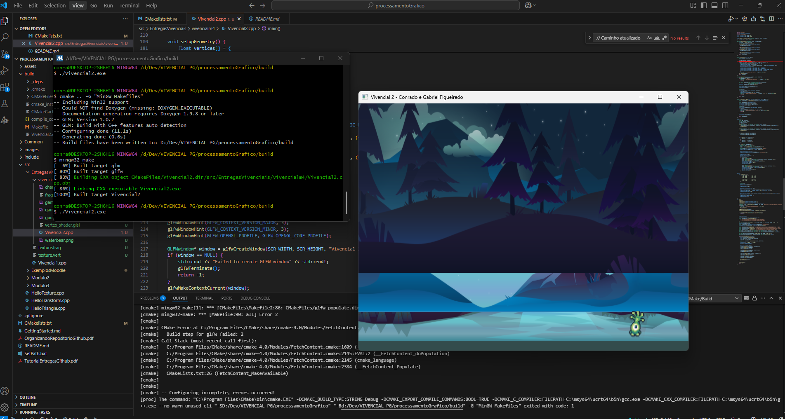

# Atividade vivencial 1:
- Gabriel Figueiredo, Conrado Maia

Este projeto implementa uma aplicação OpenGL que permite ao usuário criar triângulos clicando na tela. A cada três cliques, um triângulo é formado com uma cor aleatória.

1. Cada clique do mouse cria um vértice
2. A cada três vértices, um triângulo é criado
3. Cada triângulo tem uma cor aleatória diferente
4. A projeção ortográfica é configurada com as mesmas dimensões da janela

## Entrega

- `Vivencial1.cpp`: Código-fonte principal

- 

# Atividade vivencial 2:
- Gabriel Figueiredo, Conrado Maia

Este projeto implementa um cenário com Parallax Scrolling utilizando OpenGL, onde um personagem pode se mover, e as camadas de fundo se deslocam em diferentes velocidades para criar uma ilusão de profundidade. O cenário é contínuo.

1. O personagem do jogador pode se mover para os lados (A/D) e para cima/baixo (W/S) utilizando o teclado.
2. O fundo da cena é construído em múltiplas camadas, posicionadas igualmente no início.
3. Ao mover o personagem, as camadas se deslocam junto a ele: as camadas mais próximas se movem mais rápido, e as mais distantes, mais lentamente.
4. O cenário é contínuo, repetindo as camadas de fundo para criar a ilusão de um ambiente infinito.
5. A projeção ortográfica é configurada com as mesmas dimensões da janela (800x600 unidades).

## Entrega

- `Vivencial2.cpp`: Código-fonte principal
- `vertex_shader.glsl`: Shader de vértice
- `fragment_shader.glsl`: Shader de fragmento
- `game_background_1.png`: Textura da camada de fundo mais distante
- `game_background_4.png`: Textura da camada de fundo intermediária
- `game_background_3.png`: Textura da camada de fundo mais próxima
- `character.png`: Textura do sprite do personagem

