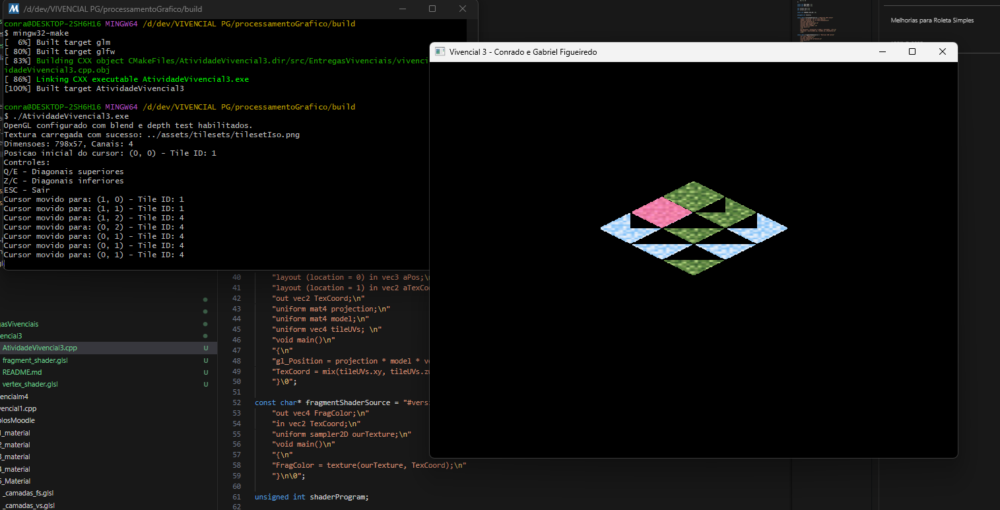
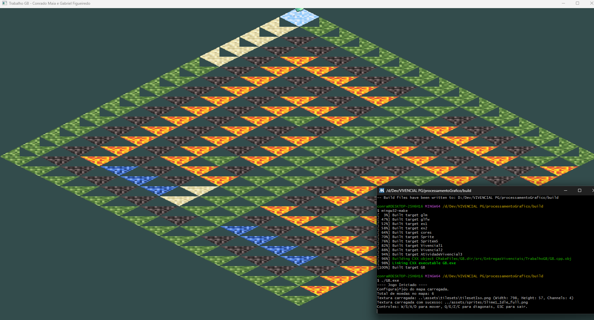
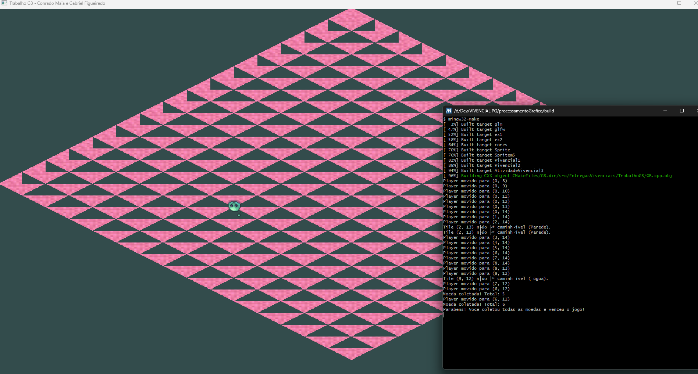
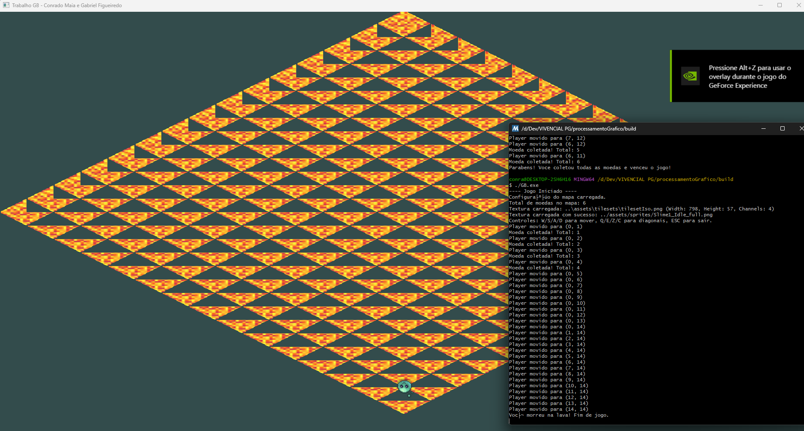

# Atividade vivencial 1:
- Gabriel Figueiredo, Conrado Maia

Este projeto implementa uma aplicação OpenGL que permite ao usuário criar triângulos clicando na tela. A cada três cliques, um triângulo é formado com uma cor aleatória.

1. Cada clique do mouse cria um vértice
2. A cada três vértices, um triângulo é criado
3. Cada triângulo tem uma cor aleatória diferente
4. A projeção ortográfica é configurada com as mesmas dimensões da janela

## Entrega

- `Vivencial1.cpp`: Código-fonte principal

- 

# Atividade vivencial 2:
- Gabriel Figueiredo, Conrado Maia

Este projeto implementa um cenário com Parallax Scrolling utilizando OpenGL, onde um personagem pode se mover, e as camadas de fundo se deslocam em diferentes velocidades para criar uma ilusão de profundidade. O cenário é contínuo.

1. O personagem do jogador pode se mover para os lados (A/D) e para cima/baixo (W/S) utilizando o teclado.
2. O fundo da cena é construído em múltiplas camadas, posicionadas igualmente no início.
3. Ao mover o personagem, as camadas se deslocam junto a ele: as camadas mais próximas se movem mais rápido, e as mais distantes, mais lentamente.
4. O cenário é contínuo, repetindo as camadas de fundo para criar a ilusão de um ambiente infinito.
5. A projeção ortográfica é configurada com as mesmas dimensões da janela (800x600 unidades).

## Entrega

- `Vivencial2.cpp`: Código-fonte principal
- `vertex_shader.glsl`: Shader de vértice
- `fragment_shader.glsl`: Shader de fragmento
- `game_background_1.png`: Textura da camada de fundo mais distante
- `game_background_4.png`: Textura da camada de fundo intermediária
- `game_background_3.png`: Textura da camada de fundo mais próxima
- `character.png`: Textura do sprite do personagem

# Atividade vivencial 3:
- Gabriel Figueiredo, Conrado Maia

Este projeto implementa um **mapa de tiles isométricos** utilizando **OpenGL** e a técnica **Diamond Isometric**. Ele permite a navegação por um cursor em 8 direções e exibe tiles de um *tileset*.

1.  **Renderização Isométrica**: Os tiles são desenhados em projeção isométrica "Diamond", onde a profundidade é determinada pela soma da linha e da coluna do grid, garantindo a ordem correta de renderização (Z-sorting).
2.  **Navegação do Cursor**: Um cursor é exibido sobre o tile atualmente selecionado no grid. Ele pode ser movido em 8 direções (N, S, L, O, NE, NO, SE, SO) utilizando as teclas **WASD** e **QEZC**, respectivamente.
3.  **Seleção de Tiles**: O mapa de tiles é carregado a partir de uma matriz pré-definida, e cada tile é renderizado com a porção correspondente do *tileset*. O tile do cursor tem um ID específico para se destacar.
4.  **Coordenadas de Textura (UVs)**: As coordenadas UV de cada tile são calculadas dinamicamente no shader, permitindo que diferentes tiles do mesmo *tileset* sejam exibidos a partir de um único quad.
5.  **Projeção Ortográfica**: A cena é renderizada usando uma projeção ortográfica com as dimensões da janela (800x600 unidades), apropriada para gráficos 2D.

## Entrega

- `AtividadeVivencial3.cpp`: Código-fonte principal
- `vertex_shader.glsl`: Shader de vértice
- `fragment_shader.glsl`: Shader de fragmento

# Trabalho GB:
- Gabriel Figueiredo, Conrado Maia

Este projeto implementa um protótipo de jogo com um mapa de tiles isométricos do tipo "Diamond", onde um personagem animado pode interagir com o ambiente, coletar itens e enfrentar obstáculos, com condições de vitória e derrota visualmente dinâmicas.

Renderização Isométrica Dinâmica: O mapa é renderizado em projeção isométrica "Diamond", com profundidade (Z-sorting) automática. A escala do jogo e o posicionamento do mapa na tela são ajustáveis.

Mapa Personalizável via Arquivo: O layout do mapa, incluindo tipos de terreno, moedas, paredes e pontos de início, é carregado dinamicamente a partir de um arquivo map.txt customizado.

Personagem Animado e Controlável: Um personagem principal, representado por um sprite sheet, pode ser controlado via teclado (WASD para cardinais, QEZC para diagonais) e possui animações para cada direção de movimento.

Interação com Elementos do Mapa:

Chão (1): Áreas caminháveis.

Parede (2): Áreas não caminháveis que bloqueiam o movimento.

Moeda (0): Itens coletáveis. Coletar todas as moedas leva à vitória.

Lava (3): Áreas não caminháveis que causam "Game Over" ao pisar.

Água (5): Áreas não caminháveis que bloqueiam o movimento.

Tile de Início (4): Define a posição inicial do personagem no mapa.

Condições de Fim de Jogo:

Vitória: Atingida ao coletar todas as moedas presentes no mapa. Ao vencer, todos os tiles do mapa mudam para uma cor de vitória (6).

Derrota: Atingida ao pisar em um tile de lava. Ao perder, todos os tiles do mapa mudam para a cor da lava (3).

Posicionamento Preciso de Sprites: O personagem é renderizado com ajustes finos de posicionamento para garantir que ele esteja visualmente alinhado sobre o centro dos tiles isométricos.

## Entrega

- `GB.cpp`: Código-fonte principal
- `map.txt`: Arquivo de configuração do mapa, especificando o layout do terreno e a localização de moedas, paredes, lava, água e o ponto de início.
- `tilesetIso.png`: Imagem do conjunto de tiles para a renderização do mapa e dos objetos
- `Slime1_Idle_full.png`: Sprite sheet do personagem animado

