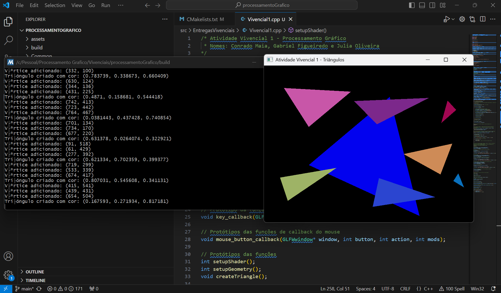

# Atividade vivencial 1:
- Gabriel Figueiredo, Conrado Maia

Este projeto implementa uma aplicação OpenGL que permite ao usuário criar triângulos clicando na tela. A cada três cliques, um triângulo é formado com uma cor aleatória.

1. Cada clique do mouse cria um vértice
2. A cada três vértices, um triângulo é criado
3. Cada triângulo tem uma cor aleatória diferente
4. A projeção ortográfica é configurada com as mesmas dimensões da janela

## Entrega

- `Vivencial1.cpp`: Código-fonte principal

- 

# Atividade vivencial 2:
- Gabriel Figueiredo, Conrado Maia

## Entrega

- `Vivencial2.cpp`: Código-fonte principal

